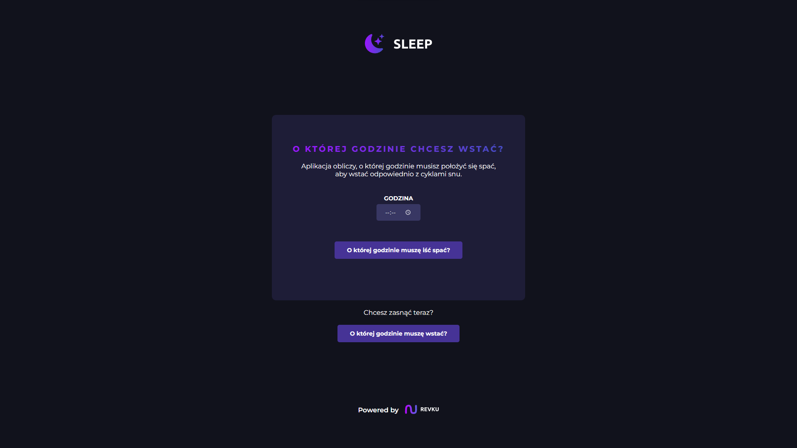
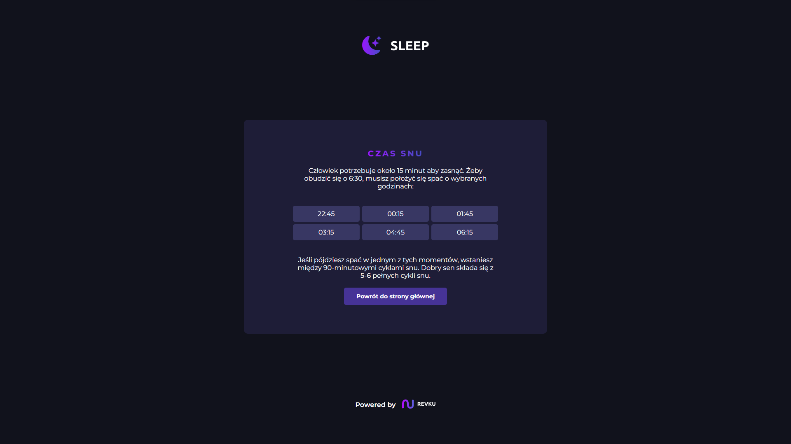

# 🌜 Sleep Calculator

An app that will calculate the time you need to go to bed to get up properly with your sleep cycles.

## 💻 Tech stack
- React (v18.0.0)
- styled-components (v5.3.5)

## 👋 Get started
1. Clone the repository
```
git clone https://github.com/Revku/sleep-calulator
```  

2. Install all depencencies
```
npm install
```  

3. Start application
```
npm start
```

## 📷 Screenshots
 
 